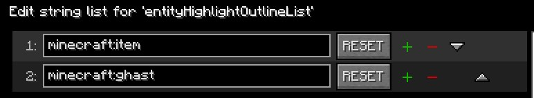
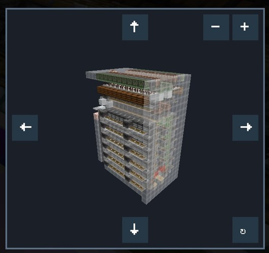

# ListMore

## 功能

- **复制准星目标 ID**：复制准星所指方块或实体的 ID。

- **实体高亮边框**：为名单中的实体类型添加原版发光描边效果。

- **实体高亮边框选择列表**：每行填写一个实体 ID。

  

- **实体高亮边框颜色**：设置名单中实体的描边颜色。

- **实体渲染黑名单**：跳过名单中实体的客户端渲染。

- **实体渲染黑名单列表**：每行填写一个实体 ID。

- **实体渲染黑名单范围**：黑名单实体在指定三维范围内会重新渲染；设为`0` 时始终不渲染。

- **掏炉灰助手**：高亮输入槽中含有无法烧制物品的普通熔炉，当前仅支持单人游戏。

- **掏炉灰助手范围设置**：以玩家所在区块为中心，设置按区块计算的扫描半径。

- **TNT 爆炸预览**：根据 TNT 的实时位置预览方块破坏范围，红色表示保守范围，黄色表示额外可能受影响的范围。

- **TNT 爆炸预览显示模式**：选择是否显示可能被炸坏的方块。

- **投射物落点预测**：显示支持投射物的预测落点。

- **投影实时预览**：在原理图文件选择界面显示当前选中原理图的预览窗口，该功能需安装 Litematica 模组才可使用。

  

- **单方块挖掘**：一次操作仅能挖掘一个方块。

- **单方块放置**：一次操作仅能放置一个方块。

## 支持版本

|Minecraft 版本|模组加载器|状态|
|---|---|---|
|1\.21\.8|Fabric|支持|
|1\.21\.10|Fabric|支持|
|1\.21\.11|Fabric|支持|
|26\.1\.2|Fabric|支持|
|26\.2|Fabric|支持|
|26\.3|Fabric|支持|

## 前置与安装

- 必需前置：Fabric Loader、Fabric API、[MaLiLib](https://modrinth.com/mod/malilib)。

- **投影实时预览** 需要同时安装 [Litematica](https://modrinth.com/mod/litematica)。未安装时，其他功能仍可正常使用。

## 问题反馈

请在 [GitHub Issues](https://github.com/Fenad2/ListMore/issues) 提交问题与建议。源码位于 [Fenad2/ListMore](https://github.com/Fenad2/ListMore)。

## 许可证

本项目采用 [LGPL\-3\.0](https://www.doubao.cn) 许可证。
